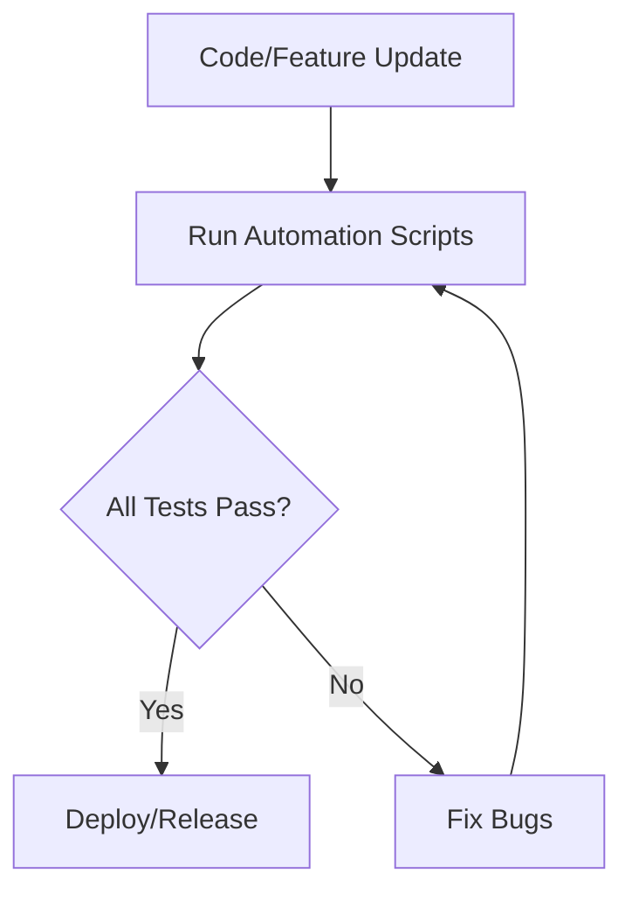

**Cursor**

非常明白！你希望**商业价值和工具对比由你主讲**，Suki和Terry多花时间介绍她们的额外任务，你自己的投诉流程介绍可以简化，避免重复。这样分配既能突出团队协作，也能让每个人有充分展示空间，同时主菜（技术能力、亮点）依然由你把控。

下面是**优化后的PPT大纲与分工**，每页内容可直接复制，附带表格、流程图SVG代码、粤语讲稿建议。

---

# 1823自动化测试关注组-“投投是道”  
1823 Automation Testing Focus Group – “Tou Tou Is The Way”  
**团队成员：Robin, Suki, Terry**

---

## 1. 封面页（主讲：Robin，0.5min）

```
1823自动化测试关注组-“投投是道”
1823 Automation Testing Focus Group – “Tou Tou Is The Way”
Robin, Suki, Terry
2025-07-23
[插入1823 Logo]
```
**粤语讲稿**  
> 「大家好，我哋系1823自动化测试关注组，‘投投是道’。我系Robin，呢度仲有Suki同Terry。」

---

## 2. 目录/项目目标（主讲：Robin，0.5min）

```
目录 / Agenda
- 团队介绍与分工 / Team & Roles
- 达标情况 / Requirements Met
- 技术流程与难点 / Technical Flow & Challenges
- 个人特色演示 / Individual Highlights
- 工具对比 / Tool Comparison
- 商业价值 / Business Value
- 总结与Q&A / Summary & Q&A

项目目标 / Project Goal
- 提升1823投诉流程自动化测试效率与覆盖率
- Improve automation testing efficiency and coverage for the 1823 complaint process
```
**粤语讲稿**  
> 「今日我哋会介绍团队分工、点样满足要求、技术难点、每个人嘅亮点、工具对比同商业价值。」

---

## 3. 团队分工与达标情况（主讲：Suki，1min）

| Member | Selenium | Playwright | Complaint Test | Extra Test 1 | Extra Test 2 | Git Collaboration |
|--------|----------|------------|---------------|--------------|--------------|-------------------|
| Robin  | ✅        | ✅          | ✅             | Chatroom     | Browser-use  | ✅ (main)         |
| Suki   | ✅        |            | ✅             | Search Bar   | Required Field | (JSON via Git)  |
| Terry  |          | ✅          | ✅             | Homepage Links | 404 Page   | (JSON via Git)  |

**粤语讲稿**  
> 「我哋每个人都用唔同工具做咗投诉流程自动化，仲有额外功能测试，Robin负责咗Git协作同Browser-use。」

---

## 4. 技术流程总览（主讲：Terry，1min）

**流程图SVG代码：**

**粤语讲稿**  
> 「整体流程包括数据驱动、自动填表、断言、报告生成，团队成员各自贡献测试数据，批量覆盖唔同场景。」

---

## 5. 主要技术难点（主讲：Robin，1min）

- 文件上传自动化（Selenium受限，Playwright可自动）
- 多语言兼容XPath
- 地址标准化断言
- 前端安全机制
- 数据驱动（Google Form+JSON）

**粤语讲稿**  
> 「做自动化过程中遇到咗文件上传、多语言、地址标准化等难题，我哋用咗唔同技术去解决。」

---

## 6. 个人特色演示（主讲：Suki、Terry、Robin，合计10min）

### 6.1 Suki（4min）
- Selenium投诉流程自动化（简要带过）
- 搜索栏测试（重点）
- 表单必填项校验（重点）
- 视频演示（边讲边放）

**粤语讲稿**  
> 「我用Selenium做咗投诉流程自动化，重点测咗搜索栏同表单必填项。过程中遇到咗……，最后点样解决……」

---

### 6.2 Terry（4min）
- Playwright投诉流程自动化（简要带过）
- 首页所有链接测试（重点）
- 404页面测试（重点）
- 视频演示（边讲边放）

**粤语讲稿**  
> 「我用Playwright做咗投诉流程自动化，重点测试咗首页所有链接同404页面。遇到咗……，点样断言……」

---

### 6.3 Robin（2min）
- Selenium/Playwright投诉流程自动化（极简带过，突出数据驱动/多工具对比/协作）
- 聊天室测试、Browser-use自动化（如有视频可放）
- Git协作与数据驱动（可结合演示）

**粤语讲稿**  
> 「我用Selenium同Playwright都做咗投诉流程，重点系数据驱动、Git协作同Browser-use自动化。」

---

## 7. 工具对比总结（主讲：Robin，1min）

| 对比项         | Selenium | Playwright |
|----------------|----------|------------|
| 浏览器         | 原生Chrome/Edge/Firefox | Chromium（内置） |
| 文件上传       | ❌ 受限   | ✅ 支持自动上传 |
| 速度           | 🐢 较慢   | 🚀 更快      |
| 兼容性         | ✅ 全主流 | ⚠️ 以Chromium为主 |
| 验证码弹窗     | 很少遇到 | 有时弹出     |
| 代码量         | 较多     | 更简洁      |

**粤语讲稿**  
> 「Selenium同Playwright各有优劣，Selenium兼容性高，Playwright自动化能力强、速度快。」

---

## 8. 商业价值亮点（主讲：Robin，1min）

- 提升投诉流程测试效率，节省人力  
  *Improves complaint process testing efficiency, saves manpower*
- 数据驱动覆盖更多真实场景，提升服务可靠性  
  *Data-driven testing covers more real scenarios, improves service reliability*
- 保障市民数据安全，助力政府数字化转型  
  *Ensures citizen data security, supports government digital transformation*

**粤语讲稿**  
> 「我哋项目唔系为赚钱，而系为提升政府服务质量、保障市民资料安全、推动数字化转型。」

---

## 9. 总结与Q&A（主讲：Suki/Terry/Robin均可，0.5min）

- 自动化测试提升效率、覆盖率，减少人手出错  
  *Automation testing improves efficiency, coverage, and reduces human error*
- 为政府数字化转型、市民体验带来实际帮助  
  *Brings real benefits to government digital transformation and citizen experience*
- 欢迎提问！  
  *Thank you! Any questions?*

**粤语讲稿**  
> 「多谢大家聆听，有咩问题欢迎随时提问！」

---

## 10. 时间分配（每人4-5分钟）

- Robin：开场、技术难点、个人演示（2min）、工具对比、商业价值、总结（约4.5min）
- Suki：分工与达标、个人演示（4min）、总结（约4.5min）
- Terry：技术流程、个人演示（4min）、总结（约4.5min）

---

## 11. 流程图SVG代码（可用Mermaid Live Editor生成SVG/PNG）


---

## 12. 美化与结构建议

- **主色调**：橙色 #F6A623、深蓝 #1A355E、白色
- **字体**：Segoe UI、Arial、Roboto
- **Logo**：封面大Logo，页脚小Logo
- **表格**：双色表头，配小图标
- **流程图**：SVG/PNG高清，圆角矩形+箭头
- **每页留白，内容简洁，重点突出**

---

如需**每页内容的可复制文本、表格、流程图SVG文件、或讲稿Word版**，请随时告诉我！

```plaintext
1823自动化测试关注组-“投投是道”
1823 Automation Testing Focus Group – “Tou Tou Is The Way”
Robin, Suki, Terry
2025-07-23
[插入1823 Logo]
```

```plaintext
目录 / Agenda
- 团队介绍与分工 / Team & Roles
- 达标情况 / Requirements Met
- 技术流程与难点 / Technical Flow & Challenges
- 个人特色演示 / Individual Highlights
- 工具对比 / Tool Comparison
- 商业价值 / Business Value
- 总结与Q&A / Summary & Q&A

项目目标 / Project Goal
- 提升1823投诉流程自动化测试效率与覆盖率
- Improve automation testing efficiency and coverage for the 1823 complaint process
```

```plaintext
graph TD
A[Code/Feature Update] --> B[Run Automation Scripts]
B --> C{All Tests Pass?}
C -- Yes --> D[Deploy/Release]
C -- No --> E[Fix Bugs]
E --> B
```

```plaintext
graph TD
A[Code/Feature Update] --> B[Run Automation Scripts]
B --> C{All Tests Pass?}
C -- Yes --> D[Deploy/Release]
C -- No --> E[Fix Bugs]
E --> B
```

---